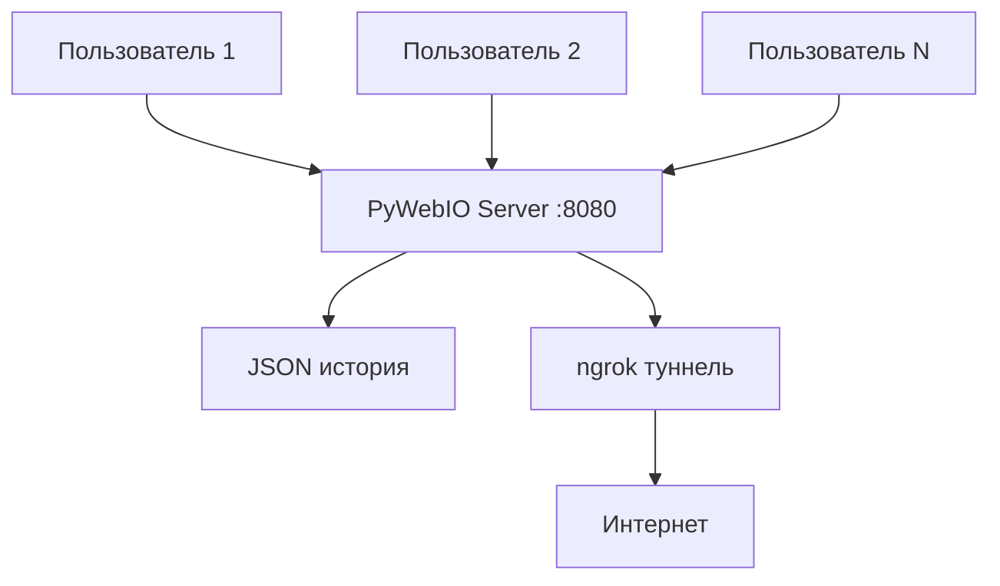

# 🚀 Космический чат HABL (Dr Vonka)

👉 https://chatvonka.base44.app/

[](https://python.org)
[](https://github.com/wang0618/PyWebIO)
[](https://ngrok.com)
[](https://opensource.org/licenses/MIT)

**HABL** — это космический онлайн-чат с уникальной атмосферой. Пользователи подключаются под космическими никами, общаются в реальном времени, а их аватары генерируются на основе ника. Поддерживает публичный доступ через ngrok и сохраняет историю сообщений между сессиями.

> 🌌 *Место, где встречаются космонавты, пришельцы и путешественники во времени*

---

## ✨ Возможности

- 🚀 **Реальное время** — сообщения появляются мгновенно
- 👨‍🚀 **Уникальные аватары** — генерируются на основе ника (8 типов + 8 цветов)
- 📡 **Публичный доступ** — автоматический туннель через ngrok
- 💾 **Сохранение истории** — все сообщения сохраняются в JSON
- 👥 **Статистика** — онлайн пользователи и общее количество посетителей
- 🎨 **Космический дизайн** — градиентный фон в стиле галактики
- 📊 **Логирование** — подробный вывод активности в консоль
- 🔄 **Автоочистка** — старые сообщения удаляются (макс. 1000)

---

## 🚀 Быстрый старт

### 1. Клонирование репозитория

```bash
git clone https://github.com/твой-username/habl-space-chat.git
cd habl-space-chat
```

### 2. Установка зависимостей

```bash
pip install -r requirements.txt
```

**Файл `requirements.txt`** (создай его в корне проекта):
```
pywebio==1.8.0
pyngrok==5.1.0
asyncio
```

### 3. Настройка ngrok (опционально)

Если хочешь публичный доступ, получи токен на [ngrok.com](https://ngrok.com) и вставь его в код:

```python
NGROK_AUTH_TOKEN = "твой-токен-здесь"
```

### 4. Запуск чата

```bash
python main.py
```

**Ожидаемый вывод:**
```
🚀 Запуск космического чата HABL
📊 Всего сообщений: 42
👥 Всего пользователей: 7
🌐 Пользователей онлайн: 3
🌌 Публичный URL: https://xxxx-xx-xxx-xx-xx.ngrok-free.app
📊 Веб-интерфейс ngrok: http://127.0.0.1:4040
```

---

## 🎮 Использование

### Подключение к чату

1. Открой браузер и перейди на один из адресов:
   - Локально: `http://localhost:8080`
   - Публично: `https://твой-адрес.ngrok-free.app`
   - Через IP: `http://твой-ip:8080`

2. Введи свой **космический ник** (до 20 символов)
3. Начни общаться!

### Интерфейс

- 💬 **Поле ввода** — пиши сообщения
- 👤 **Ник** — отображается слева от сообщения
- 🕐 **Время** — каждое сообщение имеет временную метку
- 📢 **Системные сообщения** — вход/выход пользователей

### Визуальные элементы

| Элемент | Описание |
|---------|----------|
| 👨‍🚀👩‍🚀🛸👽🤖🌠☄️🚀 | Аватары пользователей |
| 🌈 Цвета | 8 уникальных цветов для аватаров |
| 🌌 Градиент | Космический фон (фиолетовый → синий) |
| 📜 Скролл | Автоматическая прокрутка новых сообщений |

---

## 🧠 Архитектура

### Компоненты



### Поток данных

1. Пользователь вводит ник → проверка уникальности
2. Генерация аватара на основе ника
3. Сообщение добавляется в `chat_msgs`
4. Сохраняется в JSON-файл
5. Рассылается всем подключенным клиентам
6. Обновляется статистика онлайн-пользователей

---

---

## 🔧 API и внутренние функции

### Основные функции

| Функция | Назначение |
|---------|------------|
| `setup_ngrok()` | Настройка публичного туннеля |
| `load_chat_history()` | Загрузка истории из JSON |
| `save_chat_history()` | Сохранение истории в JSON |
| `get_user_avatar(nick)` | Генерация аватара |
| `log_activity(sender, action)` | Логирование действий |
| `main()` | Основной процесс чата |
| `refresh_messages()` | Обновление сообщений у клиентов |

### Формат сообщения

Каждое сообщение хранится как кортеж:
```python
(
    'user' или 'system',  # Тип
    'Текст сообщения',     # Содержимое
    'Ник отправителя',     # Автор
    '👨‍🚀',                 # Аватар
    '#4FC3F7',            # Цвет
    '14:25'               # Время
)
```

---

## ⚙️ Конфигурация
Python 3.11

В начале файла можно настроить параметры:

```python
CHAT_HISTORY_FILE = Path("space_chat_history.json")  # Файл истории
MAX_MESSAGES_COUNT = 1000                             # Макс. сообщений
NGROK_AUTH_TOKEN = None                               # Токен ngrok
```

---

## 🛠️ Возможные проблемы и решения

| Проблема | Решение |
|----------|---------|
| **ngrok не запускается** | Установи токен в `NGROK_AUTH_TOKEN` |
| **Ошибка "Address already in use"** | Порт 8080 занят, закрой другую программу |
| **Ник не принимается** | Проверь длину (макс. 20 символов) и уникальность |
| **Сообщения не сохраняются** | Проверь права на запись в папку |
| **Тормозит интерфейс** | Увеличь `MAX_MESSAGES_COUNT` или очисти историю |

### Ошибка с event loop

Если видишь ошибку про event loop, код уже содержит исправление:
```python
asyncio.set_event_loop(asyncio.new_event_loop())
```

---

## 🤝 Вклад в проект

Приветствуется:
- 🌟 Новые типы аватаров
- 🎨 Дополнительные цветовые схемы
- 📱 Мобильная адаптация
- 🔐 Аутентификация пользователей
- 📊 Админ-панель

Форкай, создавай pull request'ы, предлагай идеи в Issues!

---

## 📄 Лицензия

MIT License. Подробнее в файле [LICENSE](LICENSE).

---

## 👨‍🚀 Автор

**Dr paradox**  
- GitHub: [@твой-github](https://github.com/твой-github)  
- Telegram: [@твой-username](https://t.me/твой-username)

---

## 🌟 Благодарности

- [PyWebIO](https://github.com/wang0618/PyWebIO) — за отличный фреймворк
- [ngrok](https://ngrok.com) — за публичные туннели
- Всем космонавтам, тестировавшим чат 🚀

---

## 📊 Статистика проекта

[](https://github.com/твой-username/habl-space-chat/stargazers)
[](https://github.com/твой-username/habl-space-chat/network/members)
[](https://github.com/твой-username/habl-space-chat/issues)

---

❗❗❗ Python 3.11

*Присоединяйся к космическому общению!* 🌌👨‍🚀

🌐 https://chatvonka.base44.app/
